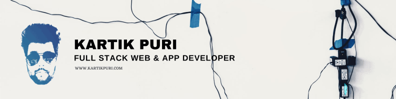

### Hi I am Kartik ! 👋

I am a Self-taught Full-stack developer who has been in the IT industry for around the last 3 years now, based at a consultancy company. I have been fortunate to be involved with building some massive IT systems, apps and Software solutions, using a range of technologies like Python, Elastic search,VueJs,DBMS, Salesforce Lightning web components

<!--
**kartikpuri95/kartikpuri95** is a ✨ _special_ ✨ repository because its `README.md` (this file) appears on your GitHub profile.

Here are some ideas to get you started:

- 🔭 I’m currently working on ...
- 🌱 I’m currently learning ...
- 👯 I’m looking to collaborate on ...
- 🤔 I’m looking for help with ...
- 💬 Ask me about ...
- 📫 How to reach me: ...
- 😄 Pronouns: ...
- ⚡ Fun fact: ...
-->

## ⚡ Technologies

## 📮 Reach Out to me

