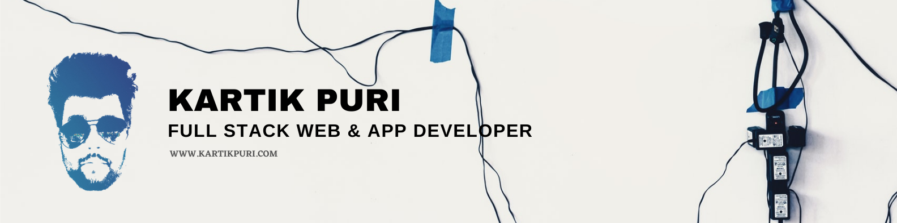

### Hi I am Kartik ! 👋

I am a Self-taught Full-stack developer who has been in the IT industry for around the last 3 years now, based at a consultancy company. I have been fortunate to be involved with building some massive IT systems, apps and Software solutions, using a range of technologies like Python, Elastic search,VueJs,DBMS, Salesforce Lightning web components

<!--
**kartikpuri95/kartikpuri95** is a ✨ _special_ ✨ repository because its `README.md` (this file) appears on your GitHub profile.

Here are some ideas to get you started:

- 🔭 I’m currently working on ...
- 🌱 I’m currently learning ...
- 👯 I’m looking to collaborate on ...
- 🤔 I’m looking for help with ...
- 💬 Ask me about ...
- 📫 How to reach me: ...
- 😄 Pronouns: ...
- ⚡ Fun fact: ...
-->

  <a href='mailto:kartik.puri95@gmail.com' >
              <svg xmlns="http://www.w3.org/2000/svg" viewBox="0 0 32 32" height="48px" aria-labelledby="title_email"><title id="title_email" lang="en">Email ID.</title><desc>My Email is kartik.puri@gmail.com</desc><path sx={{fill: 'muted'}} d="M 5 5 L 5 27 L 27 27 L 27 5 Z M 7 7 L 25 7 L 25 25 L 7 25 Z M 9 10 L 9 22 L 23 22 L 23 10 Z M 11.8125 12 L 20.1875 12 L 16 14.78125 Z M 11 13.875 L 15.4375 16.84375 L 16 17.1875 L 16.5625 16.84375 L 21 13.875 L 21 20 L 11 20 Z"/></svg>

  </a>
 
  <a href='https://www.linkedin.com/in/kartik-puri-59b59052/'>
                <svg xmlns="http://www.w3.org/2000/svg" viewBox="0 0 32 32" height="48px" aria-labelledby="title_lkdin"><title id="title_lkdin" lang="en">Link to LinkedIn.</title><desc>My LinkedIn is Amorpheuz.</desc><path sx={{fill: 'muted'}} d="M 7.5 5 C 6.132813 5 5 6.132813 5 7.5 L 5 24.5 C 5 25.867188 6.132813 27 7.5 27 L 24.5 27 C 25.867188 27 27 25.867188 27 24.5 L 27 7.5 C 27 6.132813 25.867188 5 24.5 5 Z M 7.5 7 L 24.5 7 C 24.785156 7 25 7.214844 25 7.5 L 25 24.5 C 25 24.785156 24.785156 25 24.5 25 L 7.5 25 C 7.214844 25 7 24.785156 7 24.5 L 7 7.5 C 7 7.214844 7.214844 7 7.5 7 Z M 10.4375 8.71875 C 9.488281 8.71875 8.71875 9.488281 8.71875 10.4375 C 8.71875 11.386719 9.488281 12.15625 10.4375 12.15625 C 11.386719 12.15625 12.15625 11.386719 12.15625 10.4375 C 12.15625 9.488281 11.386719 8.71875 10.4375 8.71875 Z M 19.46875 13.28125 C 18.035156 13.28125 17.082031 14.066406 16.6875 14.8125 L 16.625 14.8125 L 16.625 13.5 L 13.8125 13.5 L 13.8125 23 L 16.75 23 L 16.75 18.3125 C 16.75 17.074219 16.996094 15.875 18.53125 15.875 C 20.042969 15.875 20.0625 17.273438 20.0625 18.375 L 20.0625 23 L 23 23 L 23 17.78125 C 23 15.226563 22.457031 13.28125 19.46875 13.28125 Z M 9 13.5 L 9 23 L 11.96875 23 L 11.96875 13.5 Z"/></svg>

  </a>
 <a href='https://twitter.com/chopcoding/'>
                         <svg xmlns="http://www.w3.org/2000/svg" viewBox="0 0 32 32" height="48px" aria-labelledby="title_twitter"><title id="title_twitter" lang="en">Link to Twitter.</title><desc>My Twitter is Amorpheuz.</desc><path sx={{fill: 'muted'}} d="M 5 5 L 5 27 L 27 27 L 27 5 L 5 5 z M 7 7 L 25 7 L 25 25 L 7 25 L 7 7 z M 18.689453 10.628906 C 16.939453 10.628906 15.481672 12.207297 15.888672 14.154297 C 13.508672 14.032297 11.387609 12.895297 9.9746094 11.154297 C 9.7256094 11.578297 9.5859375 12.067562 9.5859375 12.601562 C 9.5849375 13.561562 10.064281 14.458234 10.863281 14.990234 C 10.395281 14.973234 9.9493594 14.842906 9.5683594 14.628906 L 9.5683594 14.662109 C 9.5683594 16.057109 10.552234 17.213469 11.865234 17.480469 C 11.410234 17.599469 11.012313 17.599203 10.570312 17.533203 C 10.933313 18.671203 11.991953 19.497438 13.251953 19.523438 C 12.267953 20.293438 11.034406 20.748047 9.6914062 20.748047 C 9.4554063 20.748047 9.232 20.740844 9 20.714844 C 10.269 21.528844 11.77825 22 13.40625 22 C 18.68225 22 21.570312 17.628937 21.570312 13.835938 C 21.570312 13.712938 21.569547 13.587844 21.560547 13.464844 C 22.120547 13.057844 22.610047 12.549563 22.998047 11.976562 C 22.482047 12.199563 21.923703 12.362828 21.345703 12.423828 C 21.940703 12.069828 22.391469 11.50875 22.605469 10.84375 C 22.054469 11.17175 21.432156 11.412156 20.785156 11.535156 C 20.260156 10.975156 19.516453 10.628906 18.689453 10.628906 z"/></svg>

  </a>
   <a href='https://twitter.com/chopcoding/'>
                                 <svg xmlns="http://www.w3.org/2000/svg" viewBox="0 0 32 32" height="48px" aria-labelledby="title_dev"><title id="title_dev" lang="en">Link to DEV Community.</title><desc>My DEV is Amorpheuz.</desc><path sx={{fill: 'muted'}} d="M 2 7 L 2 25 L 30 25 L 30 7 L 2 7 z M 4 9 L 28 9 L 28 23 L 4 23 L 4 9 z M 6 11 L 6 21 L 9 21 C 10.654 21 12 19.654 12 18 L 12 14 C 12 12.346 10.654 11 9 11 L 6 11 z M 16 11 C 14.897 11 14 11.897 14 13 L 14 19 C 14 20.103 14.897 21 16 21 L 18 21 L 18 19 L 16 19 L 16 17 L 18 17 L 18 15 L 16 15 L 16 13 L 18 13 L 18 11 L 16 11 z M 19.691406 11 L 21.775391 20.025391 C 21.907391 20.595391 22.415 21 23 21 C 23.585 21 24.092609 20.595391 24.224609 20.025391 L 26.308594 11 L 24.255859 11 L 23 16.439453 L 21.744141 11 L 19.691406 11 z M 8 13 L 9 13 C 9.552 13 10 13.448 10 14 L 10 18 C 10 18.552 9.552 19 9 19 L 8 19 L 8 13 z"/></svg>

  </a>

**Skills:**

## ⚡ Technologies

<!-- 

 -->
